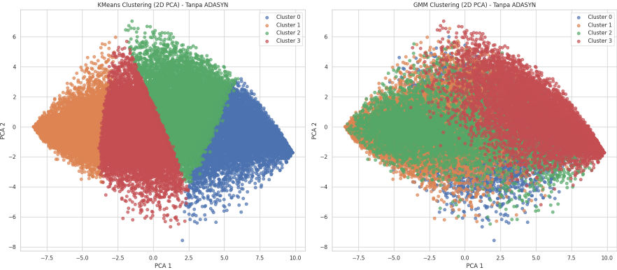
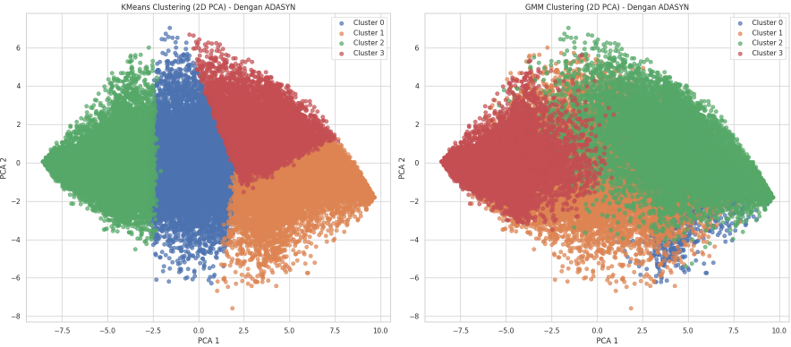

# 🧠 **Analisis Perbandingan Clustering DASS (Depression Anxiety Stress) Menggunakan K-Means dan Gaussian Mixture Model (GMM)**

---

## 📋 **Deskripsi Singkat Proyek**

Proyek ini merupakan bagian dari Tugas Besar mata kuliah Pembelajaran Mesin di Program Studi Teknik Informatika. Tujuan utama dari proyek ini adalah menerapkan dan membandingkan dua teknik **clustering**, yaitu metode **K-Means dan Gaussian Mixture Model (GMM)** dalam mengelompokkan tingkat risiko depresi, kecemasan, dan stres berdasarkan data kuesioner **DASS-42** (Depression, Anxiety, Stress Scales).

---

## 📖 **Latar Belakang Masalah**

Kesehatan mental merupakan komponen penting dalam kualitas hidup, terutama bagi mahasiswa yang sedang berada pada fase transisi menuju dunia profesional. Tekanan akademik, adaptasi sosial, tuntutan ekonomi, serta ekspektasi lingkungan menjadikan kelompok ini sangat rentan mengalami gangguan mental.

Menurut World Health Organization (2022), sekitar 12,5% populasi dunia mengalami gangguan mental, dengan usia muda dewasa (termasuk mahasiswa) sebagai kelompok paling terdampak. Di Indonesia, Riskesdas 2018 mencatat bahwa 9,8% penduduk usia 15 tahun ke atas mengalami gangguan mental emosional — angka ini menunjukkan tren peningkatan dibanding tahun-tahun sebelumnya.

Kasus terkini menunjukkan situasi yang mengkhawatirkan, di FISIP UI, 60% mahasiswa baru dilaporkan mengalami masalah kesehatan mental seperti stres, *overthinking*, dan kecemasan sosial. Respon terhadap fenomena ini sudah mulai dilakukan, seperti oleh Universitas Negeri Semarang (UNNES) yang meluncurkan layanan konseling gratis “Kawan Dengar” sebagai upaya preventif dan intervensi awal terhadap tekanan psikologis mahasiswa.

Melihat kompleksitas masalah ini, pendekatan berbasis *data-driven* menjadi solusi yang menjanjikan. Salah satunya adalah melalui **teknik clustering**, metode *unsupervised learning* yang mampu mengelompokkan data berdasarkan pola tersembunyi tanpa memerlukan label. Dalam studi ini, **clustering** digunakan untuk mengelompokkan mahasiswa berdasarkan **skor survei DASS-42 (Depression Anxiety Stress Scales)** untuk memetakan tingkat risiko kesehatan mental.

Dua metode utama yang digunakan adalah:

- K-Means, yang mengelompokkan data berdasarkan kedekatan jarak ke pusat cluster.
- Gaussian Mixture Model (GMM), yang mengasumsikan data berasal dari campuran distribusi Gaussian dan membentuk cluster berdasarkan probabilitas keanggotaan.

---

## 🎯 **Tujuan Proyek**

- Mengelompokkan tingkat risiko kesehatan mental mahasiswa (berdasarkan gejala depresi, kecemasan, dan stres) menggunakan algoritma **clustering K-Means dan Gaussian Mixture Model (GMM)** berdasarkan data **hasil survei DASS**.
- Menganalisis dan membandingkan hasil pengelompokan yang diperoleh dari metode **K-Means dan GMM** dalam hal struktur cluster dan relevansi dengan kondisi kesehatan mental responden.
- Menentukan metode **clustering** yang paling optimal dalam segmentasi tingkat risiko kesehatan mental mahasiswa.

--- 

## 🗃️ **Deskripsi Dataset**

Dataset yang digunakan dalam proyek ini berjudul "Depression, Anxiety, and Stress Scales Responses (DASS-42)", diambil dari platform Kaggle. Dataset ini berisi hasil survei psikologis dari ribuan responden yang mengisi instrumen DASS-42, serta dilengkapi dengan data demografi dan kepribadian.

### Karakteristik Dataset:  

- Jumlah data: ±39.000 entri sebelum filtering
- Sumber: Survei daring global (tahun 2017–2019)
- Format: CSV
- Jumlah kolom: 172 kolom (fitur)

### Fitur Utama: 

- DASS-42 Items (Q1A–Q42A):
- 42 pertanyaan dengan skala 0–3 untuk mengukur Depresi, Kecemasan, dan Stres
- Dibagi menjadi 14 item per aspek

### Demografi Responden:

Usia (age), jenis kelamin (gender), pendidikan (education), status hubungan (relationship status), orientasi seksual (orientation), tempat tinggal (urban/rural), dan ukuran keluarga (familysize).

---

## ⚙️ **Algoritma yang Digunakan**

### K-Means Clustering  
Metode clustering berbasis centroid, mengelompokkan data berdasarkan jarak ke pusat cluster. Efektif untuk cluster dengan bentuk seragam dan jelas.

### Gaussian Mixture Model (GMM)  
Model probabilistik yang mengasumsikan data berasal dari campuran distribusi Gaussian. Lebih fleksibel dan mampu menangani cluster yang overlap.

---

## 🚀 **Panduan Menjalankan Kode**

### Prasyarat  
Pastikan sebelum menjalankan notebook, perangkat sudah memenuhi:
- Sistem operasi: Windows / macOS / Linux
- Python 3.7 atau lebih baru sudah terinstal
- Editor kode, misalnya VSCode, JupyterLab, Jupyter Notebook

### Clone Repository dari Github 

📂 **Notebook:** [ClusteringMoodie.revisi.ipynb](./notebooks/MoodieClustering_revisi.ipynb)

- Bukalah terminal atau CMD lalu unduh kode dati Github
```bash
git clone https://github.com/ayujnnti12/Clustering-Moodie.git
cd repository-name
```

### Membuat dan Mengaktifkan Environment 
```bash
python -m venv venv
venv\Scripts\activate
```

### Instal pustaka Python berikut  
`numpy`, `pandas`, `matplotlib`, `seaborn`, `scikit-learn`, `imbalanced-learn`  

Instalasi dengan:  
```bash
pip install numpy pandas matplotlib seaborn scikit-learn imbalanced-learn
```

### atau menginstal pustaka menggunakan requirement.txt
```bash
pip install -r requirements.txt
```

### Menjalankan Notebook
- Jalankan cell satu per satu dengan klik tombol "Run" atau tekan Shift + Enter
- Pastikan setiap cell berjalan tanpa error
- Jika terdapat error terkait file atau data yang hilang, pastikan file pendukung sudah ada di folder yang sesuai atau unduh jika perlu
- Unduh file dataset dan letakkan di folder yang sama dengan notebook yang ingin dijalankan: [Dataset](./data/data.csv)

### Apa yang akan dilakukan pada notebook ini?
- **Eksplorasi Data (EDA)**  
  Memahami struktur data, mengecek nilai yang hilang, dan mengevaluasi distribusi kelas responden.
  
- **Pembersihan Data**  
  Menghapus data yang tidak valid menggunakan `Vocabulary Check List (VCL)`.

- **Normalisasi Data**  
  Menggunakan `StandardScaler` untuk menstandarisasi fitur agar model tidak bias karena perbedaan skala.

- **Clustering dengan K-Means dan GMM**  
  Mengelompokkan data ke dalam cluster berdasarkan fitur yang sudah diproses.

- **Visualisasi Hasil**  
  Menggunakan `PCA` untuk mereduksi dimensi dan menampilkan hasil clustering dalam bentuk scatter plot.

---

## 📊 **Contoh Hasil Output dan Visualisasi**

Pada bagian ini, penulis menyajikan contoh hasil output dan visualisasi yang dihasilkan dari penerapan algoritma **K-Means** dan **Gaussian Mixture Model (GMM)** untuk proses *clustering*, beserta evaluasi model dan visualisasi menggunakan **Principal Component Analysis (PCA)**.

### Interpretasi dan Visualisasi Hasil

Hasil clustering divisualisasikan dengan metode **PCA** yang mereduksi dimensi data menjadi dua komponen utama sehingga memudahkan pemahaman pola dan pemisahan antar cluster.

### Visualisasi Clustering Tanpa Penyeimbangan Data (ADASYN)



*Gambar 1: Visualisasi cluster hasil clustering tanpa menggunakan teknik penyeimbangan data.*

### Visualisasi Clustering Dengan Penyeimbangan Data (ADASYN)



*Gambar 2: Visualisasi cluster hasil clustering setelah penyeimbangan data dengan ADASYN.*

---

## 📝 **Kesimpulan**

Penelitian ini berhasil mengelompokkan responden berdasarkan data **Depression Anxiety Stress Scales (DASS)** menggunakan metode clustering **K-Means** dan **Gaussian Mixture Model (GMM)**.

- Penyeimbangan data menggunakan ADASYN meningkatkan performa clustering untuk kedua model, baik secara visual maupun metrik evaluasi.
- KMeans lebih unggul dibanding GMM dalam eksperimen ini — terutama karena: (1) Silhouette score dan Calinski-Harabasz index jauh lebih tinggi, (2) Visualisasi cluster terlihat lebih bersih dan tidak banyak tumpang tindih.
- GMM mungkin memerlukan tuning lebih lanjut atau jumlah cluster yang berbeda, karena hasilnya belum optimal, bahkan setelah ADASYN.
  
---
